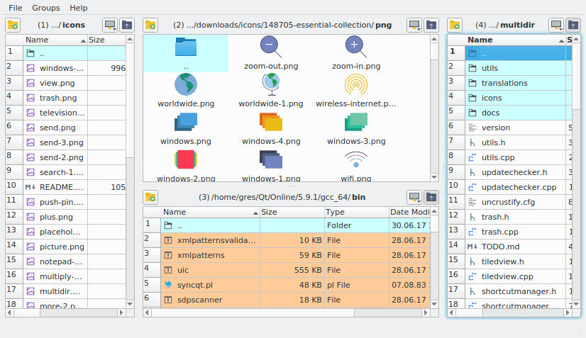
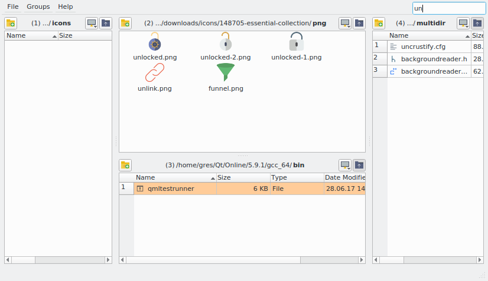
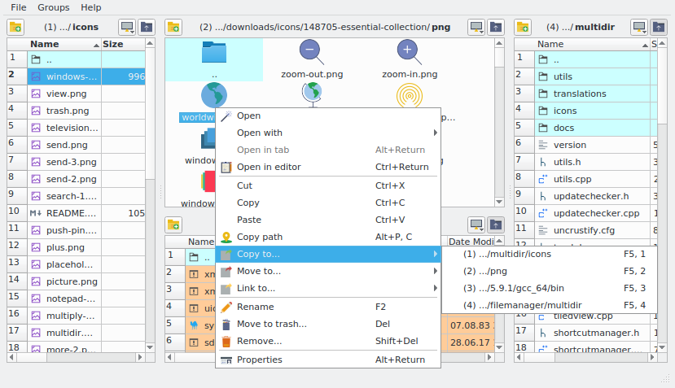
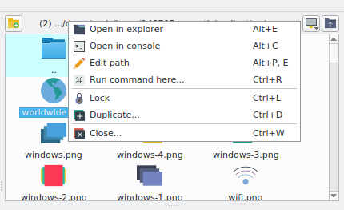

# Multidir

Multiple directory management tool.
Provides convinient way for simultaneous work with multiple folders.

**Note:** the program designed for simplification of multiple directories handling and can not fully
replace traditional file managers.

## Features

* simultaneous view of multiple folders (count is limited only by screen resolution)
* switch between several sets of folders (for work in different contexts)
* filter content in all open folders
* run custom commands with any open folder's path/current/selected files substitution
* preserve state between launches
* rich customization capabilities

## Screeshots

## Installation

* run AppImage file for linux distributions
* run installer for windows

## Building from source

### Requirements

* c++ compiler with c++11 support
* Qt 5.6+ and some additional libs (more concrete list [here](utils/precise/Dockerfile))

### Compilation

* run `qmake` then `make`
* *optionally* run `lrelease multidir.pro` to compile translation files

## License

Released under [GPLv3 License](LICENSE.md).
